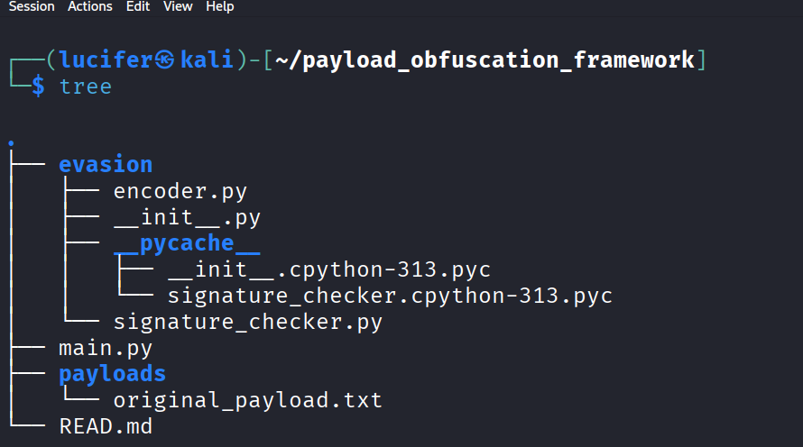
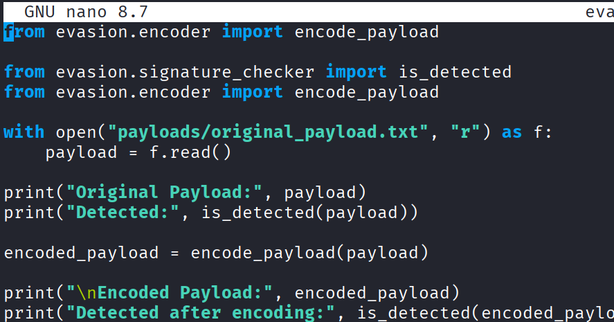
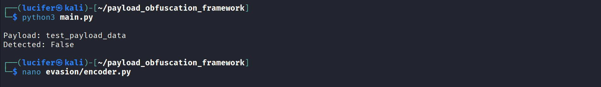

# Payload Obfuscation Framework

Project Description
Explain in simple terms:
what payload obfuscation is
why attackers use it
why defenders must understand it

Objectives
Example:

Understand payload encoding
Simulate obfuscation techniques
Learn detection evasion concepts
Practice Python-based security tooling

Project Structure
payload_obfuscation_framework/
│
├── encoder.py
├── main.py
└── screenshots/

Execution
python3 main.py

## Screenshots

### Project Structure


### Encoder Function


### Execution Output


# Payload Obfuscation Framework

A Python-based framework designed to demonstrate payload obfuscation techniques used in cybersecurity for understanding detection evasion and defensive analysis.
This project focuses on transforming payloads using encoding and obfuscation methods to simulate how adversaries modify payloads to bypass signature-based detection systems.

## Purpose

Adversaries often modify payloads to evade security controls such as antivirus signatures, IDS/IPS rules, and static detection mechanisms. 

This project was created to:
- Understand payload transformation techniques
- Demonstrate encoding and obfuscation concepts
- Explore how defensive tools detect modified payloads
- Improve understanding of offensive and defensive security workflows

This project is intended for educational and research purposes only.


## Features

- Base64 payload encoding
- XOR-based obfuscation
- Modular framework structure
- Easy extension for additional encoding techniques
- Python-based implementation


## Project Structure

payload-obfuscation-framework/
│
├── src/ # Source code
├── screenshots/ # Project screenshots
├── README.md
└── .gitignore

## Screenshots

### Project Setup


### GitHub Repository Upload


## Installation

```bash
git clone git@github.com:lucifermorningstar191/payload-obfuscation-framework.git
cd payload-obfuscation-framework


python3 src/encoder.py


---

## 7️⃣ Learning Outcomes (Very Important for Portfolio)

This is what makes it valuable for jobs.

```markdown
## Learning Outcomes

- Understanding payload obfuscation concepts
- Practical experience with encoding techniques
- Improved Python scripting skills
- Exposure to offensive security methodologies
- Understanding detection evasion at a conceptual level


## Disclaimer

This project is developed for educational purposes only. The author does not promote or support malicious use of this software.


